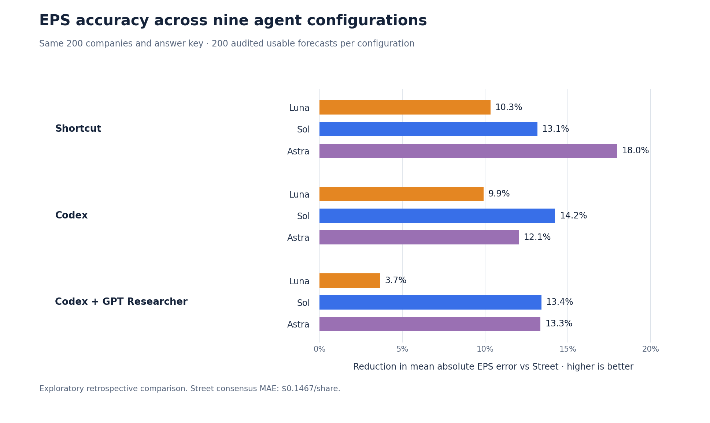
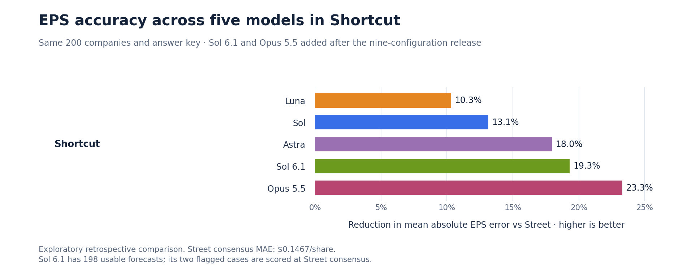
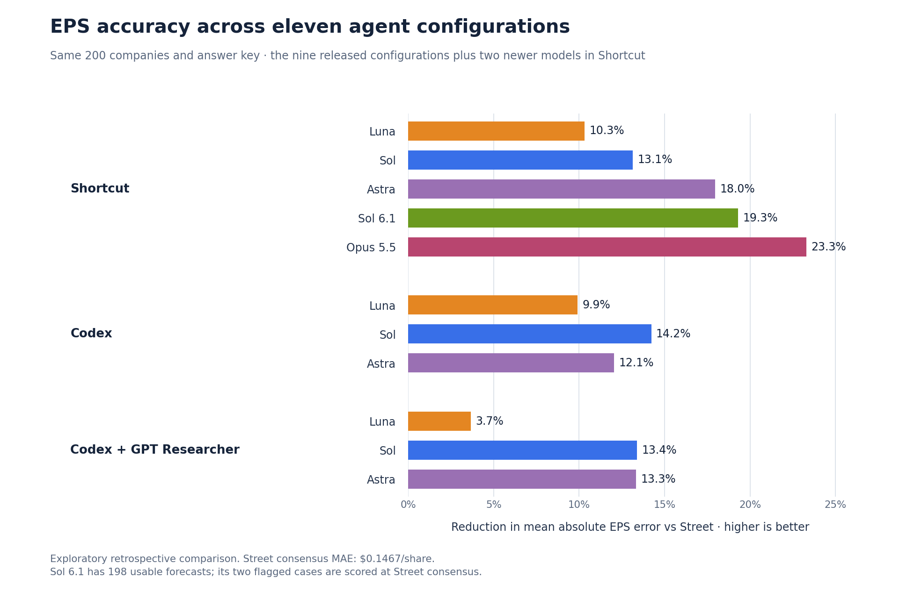
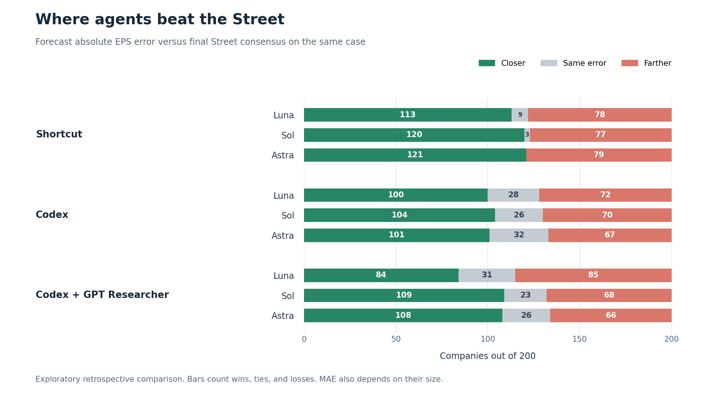

<div align="center">


# Streetbench

**Can AI agents searching widely across the web forecast earnings more accurately than Wall Street?**

200 Q2 2026 companies · 9 agent configurations · 200 forecasts per configuration

[Results](#results) · [What we found](#what-we-found) · [How the backtest works](#how-the-backtest-works) · [Try the benchmark](#try-the-benchmark) · [Explore the repo](#explore-the-repo)

</div>

Sell-side analysts turn company guidance, filings, and industry research into earnings estimates that investors use as a baseline. **Streetbench tests whether those agents can produce **a closer EPS estimate** than the Street consensus**. An agent can also show its sources and assumptions, giving investors an analyst-style baseline they can question, change, and work through themselves.

## Results

**The best run reduced average EPS error by 18.0%.** [Shortcut](https://shortcut.ai/) with Astra averaged **$0.1203 per share** in absolute error, compared with **$0.1467** for the final Street consensus on the same 200 companies.



Each bar shows the reduction in mean absolute error, or MAE, against the Street. Longer bars mean smaller EPS errors. Every configuration produced 200 usable forecasts for the same frozen cases.

| Agent setup | Model | Forecasts | EPS MAE | Error reduction vs Street |
| --- | --- | ---: | ---: | ---: |
| Shortcut | Luna high | 200/200 | $0.1316 | 10.3% |
| Shortcut | Sol high | 200/200 | $0.1274 | 13.1% |
| Shortcut | Astra high | 200/200 | **$0.1203** | **18.0%** |
| Codex | Luna high | 200/200 | $0.1322 | 9.9% |
| Codex | Sol high | 200/200 | $0.1258 | 14.2% |
| Codex | Astra high | 200/200 | $0.1290 | 12.1% |
| Codex + GPT Researcher | Luna high | 200/200 | $0.1413 | 3.7% |
| Codex + GPT Researcher | Sol high | 200/200 | $0.1270 | 13.4% |
| Codex + GPT Researcher | Astra high | 200/200 | $0.1271 | 13.3% |

MAE is the average of `|forecast EPS − reported EPS|` in USD per share. Error reduction compares each MAE with the Street's MAE on those same reports. The [machine-readable scores](results/scores.json) retain the underlying precision.

### Newer models in Shortcut

After the nine-configuration release we ran two newer models in Shortcut on the same 200 cases, both at high effort. **Opus 5.5 reduced average EPS error by 23.3%**, averaging **$0.1125 per share**. Sol 6.1 reduced it by 19.3%.



| Model in Shortcut | Forecasts | EPS MAE | Error reduction vs Street |
| --- | ---: | ---: | ---: |
| Luna high | 200/200 | $0.1316 | 10.3% |
| Sol high | 200/200 | $0.1274 | 13.1% |
| Astra high | 200/200 | $0.1203 | 18.0% |
| Sol 6.1 high | 198/200 | $0.1184 | 19.3% |
| Opus 5.5 high | 200/200 | **$0.1125** | **23.3%** |

Opus 5.5 was closer than Astra on 115 of the 200 companies. Sol 6.1's edge over Astra is small next to the case-to-case variation, so we read those two as level.



Read the newer rows with three caveats. Sol 6.1 has 198 usable forecasts: two cases were flagged for target-results exposure on every attempt and are scored at Street consensus. Both runs used a later Shortcut runtime setup and models with later knowledge cutoffs than the released ones. The release's evidence audit has not been repeated for them. The [newer-model scores](results/newer-models.json) hold the underlying numbers, and [this script](scripts/render_newer_models.py) rebuilds both graphs.

## What we found



- **Stronger models helped within Shortcut.** MAE fell from **$0.1316** with Luna to **$0.1274** with Sol to **$0.1203** with Astra. Astra was closer than Luna on 126 of the 200 companies. That progression is encouraging, although a retrospective result cannot tell us that every model upgrade will help.
- **The pattern did not repeat everywhere.** Codex with Sol had a slightly lower MAE than Codex with Astra, **$0.1258** versus **$0.1290**. On individual companies, Astra beat Sol 67 times, lost 77 times, and tied 56 times.
- **A separate research pass was not a consistent improvement.** GPT Researcher gathers information before Codex makes its forecast. That setup did worse than Codex alone with Luna and Sol, and slightly better with Astra. With Luna it was worse on 101 companies and better on 70.
- **The best average still had misses.** Shortcut with Astra was closer than the Street on **121 companies** and farther away on 79. The size of each error matters as well as the number of wins.

The selected Shortcut Astra writeups cited a median of **nine source links** per company. They linked to SEC pages in **198 of 200** cases and to another domain in **199**. Their explanations discussed guidance, revenue, expenses, and share count. The [case comparison data](results/diagnostics.json) has the counts behind the second graph.

## How the backtest works

1. **Fix the question.** The [case file](data/cases.jsonl) specifies each company, fiscal period, normalized diluted EPS target, and exact research cutoff. The cutoff was set to 4 pm New York time two U.S. trading days before the observed earnings report.
2. **Bound the evidence.** Agents received earlier financial history and used [Exa Snapshot](https://exa.ai/docs/search/snapshot) for web research at each case cutoff. Search and page reads used the same `snapshotAsOf` timestamp, with no live-web fallback. Reported target EPS and final Street consensus stayed out of the forecasting tasks.
3. **Run nine configurations.** We paired Luna, Sol, and Astra at high effort with Shortcut, Codex, and Codex + GPT Researcher. Failed attempts and attempts flagged for target-results exposure were excluded. Each score uses one audited usable forecast for every frozen case.
4. **Compare the errors.** Each forecast and the final Street consensus were compared with the same reported EPS value. The [benchmark spec](BENCHMARK_SPEC.md) defines the target and Snapshot requests, while [methods](docs/METHODS.md) document the evidence review and limits.

OpenAI lists knowledge cutoffs of [April 20 for Sol](https://developers.openai.com/api/docs/models/gpt-6-sol), [April 30 for Astra](https://developers.openai.com/api/docs/models/gpt-6-astra), and [May 18 for Luna](https://developers.openai.com/api/docs/models/gpt-6-luna), before these Q2 results were published. That reduces direct model-memory concern, but the runs happened after earnings were public, so retrieved evidence still needed review.

**How to read the claim.** This is a retrospective comparison of complete agent setups. Exa Snapshot bounds page content, but its search ranking is not a historical replay. The Street baseline is final uploaded consensus, not consensus independently captured at each cutoff. The result does not establish live forecasting or investment performance. The [evidence audit](results/snapshot-evidence-audit.json) states what was checked.

## Try the benchmark

The target is **$0.1203 MAE** on the same 200 companies. Try a different model, agent architecture, or research strategy while keeping the [case IDs and cutoffs](data/cases.jsonl) fixed.

1. Fill the [forecast template](data/submission-template.csv) with one EPS estimate per case.
2. Validate the completed file.
3. Fill the [local answer template](data/answers-template.csv) with normalized diluted EPS from a source you may use, then score your run.

```sh
python3 scripts/challenge.py validate forecasts.csv
python3 scripts/challenge.py score-local forecasts.csv --answers answers.csv
```

The original historical numbers, archived pages, and answer values are not redistributed because their sharing rights have not been established. Your local score may differ if your EPS definition or consensus source differs. The [challenge guide](CHALLENGE.md) gives the full setup and explains how to check your evidence boundary.

## Explore the repo

| If you want to | Start here |
| --- | --- |
| See the 200 companies and cutoff times | [Cases and data notes](data/README.md) |
| Understand the EPS target and Snapshot requests | [Benchmark spec](BENCHMARK_SPEC.md) |
| Run and score your own forecasts | [Challenge guide](CHALLENGE.md) and [scorer](scripts/challenge.py) |
| Inspect the nine results | [Scores](results/scores.json) and [case comparisons](results/diagnostics.json) |
| Review evidence checks and limitations | [Methods](docs/METHODS.md) and [Snapshot audit](results/snapshot-evidence-audit.json) |
| Rebuild the figures or verify the release | [Result graph script](scripts/render_results.py), [case graph script](scripts/render_diagnostics.py), and [release verifier](scripts/verify_release.py) |

To check this release locally, run `python3 -m unittest discover -s scripts/tests` and `python3 scripts/verify_release.py`. The graphs can be regenerated with the pinned dependency in [requirements-graphs.txt](requirements-graphs.txt).

Streetbench measures a retrospective cohort. For forecasts published before earnings, with the models and eventual results kept on the record, see [Beat the Street](https://beatthestreet.live/).
